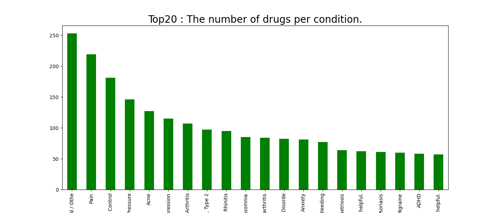

# UCI Drug Review Dataset EDA
> 해당 데이터셋은 [Winter 2018 Kaggle University Club Hackathon](https://www.kaggle.com/jessicali9530/kuc-hackathon-winter-2018)에서 사용되었던 데이터셋으로, 1차적으로 제출된 코드를 투표 수 1~5위까지 각 팀원이 분석 및 참조하여 정리하기로 하였습니다.


### Kaggle Review Reference
 - [Drug recommendation using review in Kaggle](https://www.kaggle.com/bhuemims/recommendation-medicines-by-using-a-review)
 - [Predicting review scores using neural networks](https://www.kaggle.com/stasian/predicting-review-scores-using-neural-networks)
 - [EDA and Sentiment Analysis](https://www.kaggle.com/sumitm004/eda-and-sentiment-analysis)
 - [Team NDL: Algorithms and Illnesses](https://www.kaggle.com/neilash/team-ndl-algorithms-and-illnesses)
 - [A gentle introduction to Sentiment Analysis](https://www.kaggle.com/adarshchavakula/a-gentle-introduction-to-sentiment-analysis)


# Data Analysis
## 전체 데이터 구성
uniqueID를 가진 환자가 가지고 있는 증상에 필요한 약을 구입한 뒤에 특정 날짜(date)에 review와 rating을 남김. 그리고 다른 환자가 해당 리뷰를 보고 도움이 되었는지에 대해 usefulCount attribute에 점수(1점 추가)를 줌

## 1. Training data는 161297개, Test data는 53766개


## 2. Attribute는 uniqueID를 포함해서 training data와 test data 모두 7개가 있음
| uniqueID | drugName | condition | review | rating | date | usefulCount |
| -------- | -------- | --------- | ------ | ------ | ---- | ----------- |
| identify individual data | name of drug | name of condition | patient review | 10 star patient rating | date of review entry | number of users who found review useful |

1. uniqueID

    한명의 고객이 중복해서 여러 리뷰를 작성했는지 검사
    ```python
    uniqueID를 기준으로 확인 : 215063
    set        메서드로 확인 : 215063
    ```
    > 전체 215063개의 데이터에 대해 각각 161297개의 training data와 53766개의 test data에 대해 중복된 uniqueID는 없음


2. condition , drugName
    ```python
    The number of unique condition is 917
    The number of unique drugName  is 3671
    ```
    condition 열에서 unique하게 917개

    데이터를 수집하는 과정중에서 condition항목에 ``` '3</span> users found this comment helpful.'```이라는 에러  데이터가 들어가 있음. ```(4</span>...도 마찬가지)```

    condition의 경우, 약품 명과 관련이 깊으므로 둘과 연관지어서 데이터를 알아볼 수 있다고 함

    #### 약물당 컨디션 수(상위20)
    
                
    #### 약물당 컨디션 수(하위20)
    
            
    #### 컨디션당 약물 수 (상위20)
    
            
    #### 컨디션당 약물 수 (하위20)
    

 
3. review
    html 태그가 존재하는 경우도 있고, 괄호 안에 감정 구문을 넣거나 특정 단어를 대문자로만 적은 경우도 있음.
            
    <strong>특정 문자가 깨진 경우(에러)도 존재</strong>


4. rating

    rating은 1~10점까지 존재하며, 1점씩 interval을 가짐
    각 rating별 review의 개수는 아래와 같이 분포
    
    사람들이 대부분 극단적으로 점수를 줌을 알수있으며, 10점이 9, 1, 8점보다 약 2배 높음

5. date
    2008년 2월 24일부터 2017년 12월 12일까지 존재
    ```
    Output
    가장 처음 날짜   : 2008-02-24
    가장 마지막 날짜 : 2017-12-12
    ```

    년도별 리뷰 개수 
    
    -> 조금씩 늘어나는 모습

    salary day와 같이, 날짜가 rating에 영향을 미치는지 알아보기 위해 아래와 같이 일(day)별 평균 rating을 파악

    
    -> 전혀 영향을 미치지 않음

6. usefulCount
    해당 소스코드에서는 약의 효과에 관계없이, 사람들이 더 많이 찾는 약일수록 사람들이 더 많이 review를 읽어보고 usefulcount를 높게 주는 경향이 있다고 함

    
            
    ```python
    Output
    usefulCount의 대한 통계 count    215063.000000
    mean         28.001004
    std          36.346069
    min           0.000000
    25%           6.000000
    50%          16.000000
    75%          36.000000
    max        1291.000000
    Name: usefulCount, dtype: float64
    ```